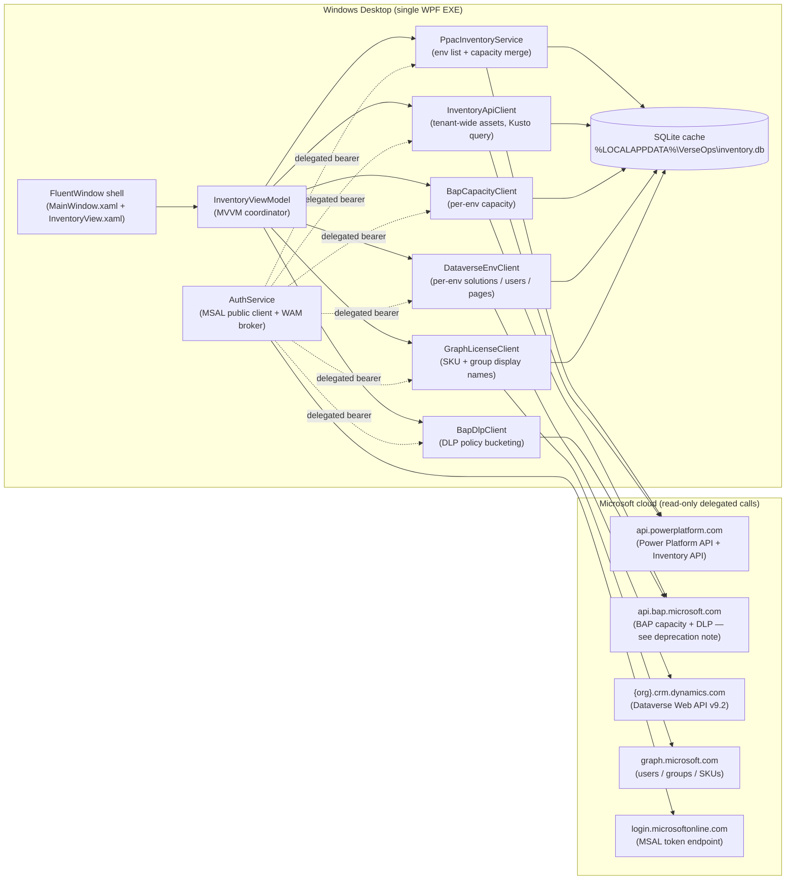

# Power Platform tenant inventory in 60 seconds — what becomes possible when the API tells the truth

> A community walk-through of **VerseOps**, an open-source WPF dashboard that pulls a live inventory of an entire Power Platform tenant — environments, capacity, solutions, apps, flows, agents, users, licenses — into one window using only the **official Microsoft Power Platform Management SDK** (`api.powerplatform.com`), the legacy **BAP capacity API** while it remains, **Microsoft Graph**, and the per-environment **Dataverse Web API**.
>
> No connectors, no service principals, no telemetry, no SaaS backend.
> Source: [github.com/SweetsNSavories/VerseOps](https://github.com/SweetsNSavories/VerseOps) · MIT.

![VerseOps loaded against a real ~700-environment tenant. Single-window WPF FluentWindow with Mica backdrop. Five hero KPI tiles populated end-to-end: Environments=716 synced from PPAC, Tenant Database=383.7 GB and Tenant File=4,472.7 GB (both Healthy), Total Assets=146,462 (LIVE from the Power Platform Inventory API), Licensed Users tile loading async from Microsoft Graph. Identifying columns — Name, Security Group, Instance URL, Env ID — are pixelated; capacity numbers, SKU, region, and version are real.](images/02-loaded.png)
*Figure 1 — VerseOps loaded against a live tenant. Per-row capacity (DB / File / Log / FinOps DB / FinOps File GB) is computed from the BAP `$expand=properties.capacity` call; per-env asset counts are joined client-side from the Inventory API result set. Tenant identifiers redacted; everything else is real.*


*Figure 2 — One environment row expanded. The row-details template fans out the inventory: Solutions / Apps / Flows / Agents (joined from the Inventory API and per-env Dataverse Web API calls), Power Pages sites (`mspp_website` table on the env's Dataverse), and the env's `systemusers` (with their assigned licenses joined from Microsoft Graph). All asset counts (9 / 3 / 53 / 241) are real.*

![Right-side "Total Assets" drawer overlaying the dashboard. Drawer header reads "Total Assets — 146,462 assets across 716 environments (Power Platform Inventory API, single tenant-wide query)." Inside the drawer, six per-type cards stacked vertically: Cloud Flow 122,655 · Copilot Agent 13,803 · Model-driven App 8,143 · Canvas App 1,317 · Agent Flow 468 · Code App 76. Each card also shows "most recent: <name>" — those flow / agent / app names are blurred. The grid behind the drawer is dimmed and identifying columns are pixelated as in Figure 1.](images/03-drawer-assets.png)
*Figure 3 — Total Assets drawer (click the Total Assets KPI tile). The whole panel is fed by a single tenant-wide Inventory API query; the per-type counts are computed client-side from `assetType`. The "most recent" name surfaces the freshest asset of each kind so an admin can sanity-check that the tenant feed is current.*

![Right-side "Licenses Consumed" drawer overlaying the dashboard. Drawer header reads "Licenses Consumed — 300 distinct licensed users across 58 SKUs (Microsoft Graph subscribedSkus catalog)." Inside the drawer, per-SKU cards stacked vertically with seat counts on the right: ENTERPRISEPREMIUM 194 · FLOW_FREE 176 · POWERAPPS_DEV 144 · POWERAPPS_PER_USER 133 · DYN365_ENTERPRISE_PLAN1 127 · POWER_BI_STANDARD 109 · CCIBOTS_PRIVPREV_VIRAL 99 · DYN365_ENTERPRISE_CUSTOMER_SERVICE 93 · Microsoft_365_Copilot 84 · STREAM 71 · VIRTUAL_AGENT_USL 65 · Power_Pages_vTrial_for_Makers 59 · POWERAPPS_VIRAL 44 · DYN365_FINANCE …](images/04-drawer-licenses.png)
*Figure 4 — Licenses Consumed drawer (click the Licensed Users KPI tile). The list is the union of every assigned `servicePlan` from `/users?$select=assignedLicenses` rolled up to the SKU level using the tenant's `subscribedSkus` catalog from Microsoft Graph. SKU codes are public; the only tenant-specific data is the per-SKU seat count on the right.*

---

## Why this exists

Every Power Platform admin I've talked to has the same problem at the start of every quarter:

> *"How many environments do we actually have? Who owns the apps in them? How much Dataverse capacity is sitting in places no one remembers creating? Which makers left the company three months ago and still own production flows?"*

The official answers — Power Platform admin center (PPAC), the **Power Platform inventory** page, and the **Usage** page — all already exist and are excellent for daily work. But there are still moments when an admin needs:

1. A **single offline snapshot** they can search, sort, filter, and ship to a stakeholder without exposing the live admin center.
2. A **diff** between this morning and last Friday — *what changed?*
3. **Joined views** that the portal doesn't ship out of the box: per-env capacity × per-env asset count × per-env user count, all in one sortable grid.
4. The **raw JSON** behind every row, one click away, when something doesn't match what the portal shows.
5. A **starting point** — code they can fork, instrument, and turn into the governance tool they actually wanted.

That's what VerseOps is. The whole UI is ~5 files. The whole "what calls go out" is documented in [docs/network-endpoints.md](../network-endpoints.md). It's deliberately small, deliberately read-only-by-design, and deliberately unashamed about being a starting point — not a finished governance suite.

---

## How it complements the official "Inventory" and "Usage" pages

Microsoft's [Power Platform inventory](https://learn.microsoft.com/power-platform/admin/power-platform-inventory) gives administrators a unified view of agents, apps, and flows tenant-wide, refreshed within ~15 minutes. The [Usage page](https://learn.microsoft.com/power-platform/admin/usage) tracks engagement and adoption. Both ship in the admin center today and should be every admin's first stop.

VerseOps is positioned as a **complement, not a replacement**:

| Need | PPAC Inventory / Usage | VerseOps |
|---|---|---|
| Daily inventory browsing in a portal | ✅ Recommended | n/a |
| Filter / sort / search on any column | ✅ | ✅ |
| Resource-detail drill-in (owner, env, dates) | ✅ | ✅ |
| Export to Excel | ✅ | ✅ (CSV / cache copy) |
| **Capacity (DB / File / Log / FinOps GB) joined per env on the same row as asset count** | Partial | ✅ |
| **One-click "show me the raw Dataverse / PPAC JSON" inspector** | ❌ | ✅ |
| **Local SQLite cache for offline browsing on a plane / in an air-gapped review** | ❌ | ✅ |
| **Diff between today's snapshot and yesterday's** | ❌ | ✅ (cache-based, on roadmap) |
| **Source you can fork** | n/a | ✅ MIT, single solution |
| **Telemetry sent to Microsoft / vendor** | per Microsoft's data policy | **None — zero outbound calls beyond Microsoft's own APIs** |

If you only ever need 1–4 above, stay in the admin center; it's faster and always up to date. VerseOps shows up when you need 5–11.

---

## Architecture in one diagram



A few things this diagram makes obvious that aren't always obvious:

- **One process, no agent / no server.** Everything runs in the user's logged-in security context. There is no daemon, no sync job, no message bus. The OS schedules the network calls; the user clicks Refresh.
- **Two planes in the Microsoft cloud.** The "management plane" calls (`api.powerplatform.com`, `api.bap.microsoft.com`, `graph.microsoft.com`) and the "data plane" calls (`{org}.crm.dynamics.com` per environment). The app handles the audience switching for each, so you never have to think about it.
- **The local SQLite database is the only state.** Wipe `%LOCALAPPDATA%\VerseOps\` and the app forgets everything. There is nowhere else for data to live.

---

## What's actually feasible with the Power Platform API today

Microsoft has been very public about its [shift from a UX-first to an API-first development model for Power Platform programmability](https://devblogs.microsoft.com/powerplatform/power-platform-api-and-sdks-from-ux-first-to-api-first/): new capabilities ship in the API first, then propagate to SDKs, CLI, PowerShell cmdlets, and connectors. The [Programmability and extensibility overview](https://learn.microsoft.com/power-platform/admin/programmability-extensibility-overview) lays out the full toolchain — REST API, .NET SDK ([Microsoft.PowerPlatform.Management](https://www.nuget.org/packages/Microsoft.PowerPlatform.Management/)), Python SDK, Power Platform CLI, PowerShell cmdlets, and the Power Platform for Admins V2 connector.

VerseOps is a deliberately small showcase of what the **.NET SDK + Inventory API** combination unlocks once you put a UI on it:

| Capability | API used | SDK / endpoint |
|---|---|---|
| List every environment in the tenant with name / region / SKU / version / security group / default-flag | Power Platform API (PPAC) | `Microsoft.PowerPlatform.Management` SDK |
| Per-tenant capacity (DB / File / Log / FinOps DB / FinOps File GB) | Power Platform API (PPAC) | SDK `Licensing.Tenant.GetCurrentCapacityAllocations()` |
| Per-environment capacity in **one tenant-wide call** | BAP capacity (legacy GA) | `GET /providers/Microsoft.BusinessAppPlatform/scopes/admin/environments?api-version=2020-10-01&$expand=properties.capacity` |
| **Every** canvas app, model-driven app, code app, cloud flow, agent flow, and Copilot Studio agent in the tenant in **one POST** | Inventory API (preview) | `POST https://api.powerplatform.com/resourcequery/resources/query?api-version=2024-10-01` (KQL-style query against `PowerPlatformResources`) |
| DLP policies + connector classification (Business / Non-Business / Blocked) | BAP Governance v2 | `GET /providers/PowerPlatform.Governance/v2/policies?api-version=2018-01-01` |
| Per-env solutions / Power Pages sites / system users / roles / app + flow status | Dataverse Web API v9.2 | `GET {org}/api/data/v9.2/solutions`, `appmodules`, `workflows`, `canvasapps`, `systemusers`, `mspp_websites` |
| User license SKU resolution + security-group display names | Microsoft Graph | `GET /v1.0/subscribedSkus`, `/users`, `/groups`, `/directoryObjects/getByIds` |

The headline shape of this: **one tenant-wide POST replaces what used to be N×6 per-environment GETs.** For a tenant with 700 environments, that's the difference between ~4,000 round-trips per refresh and ~10. The same `Microsoft.PowerPlatform.Management` SDK that powers the new admin-center surfaces is the same one your tooling uses — there's no longer a "fast official one and a slow community one".

---

## A note on the BAP API deprecation path

Several BAP routes the community has relied on for years are now in a clear *consolidation* track rather than a *deprecation* one — but the destination is the same. From the official [Versioning and support](https://learn.microsoft.com/power-platform/admin/programmability-versioning-support) page:

> *"The 2020-10-01 Generally available version of Power Platform API is specific to environment management and is also commonly referred to as **Business Application Platform (BAP) API**. The functionality of this set of endpoints are made available in the newer versions of Power Platform API along with many additional features after version 2022-03-01-preview."*

In practice, what this means for tools like VerseOps:

| BAP route VerseOps uses today | Status (May 2026) | Modern equivalent on `api.powerplatform.com` |
|---|---|---|
| `/scopes/admin/environments?$expand=properties.capacity` | GA (`api-version=2020-10-01`); functionally superseded but still recommended for tenant-wide capacity | Will move to a Licensing namespace endpoint as parity completes; track [Programmability what's new](https://learn.microsoft.com/power-platform/admin/programmability-whats-new-changed) |
| `PowerPlatform.Governance/v2/policies` (DLP) | Stable | Watch the new Connectivity / Governance namespace endpoints (e.g. [List Connectors](https://learn.microsoft.com/rest/api/power-platform/connectivity/connectors/list-connectors), shipped July 2025) |
| `Microsoft.BusinessAppPlatform` provider routes | All being mirrored under `api.powerplatform.com` namespaces (Licensing, EnvironmentManagement, AppManagement, Authorization, Governance, Connectivity) | Use the SDK — Microsoft maintains the mapping for you |

Microsoft's official guidance is unambiguous: **use the Power Platform API surface (`api.powerplatform.com`) and one of the official SDKs** ([.NET](https://www.nuget.org/packages/Microsoft.PowerPlatform.Management/), [Python](https://pypi.org/project/powerplatform-management/), CLI, PowerShell, [Power Platform for Admins V2 connector](https://learn.microsoft.com/connectors/powerplatformadminv2/)) for any new automation. BAP routes won't disappear without a deprecation cycle, but new features ship to `api.powerplatform.com` first and may never come back to BAP.

VerseOps reflects this exactly: every new feature added since April 2026 went to `api.powerplatform.com`, the BAP capacity client is isolated to a single ~150-line file ([BapCapacityClient.cs](../../VerseOps.App/Inventory/Services/BapCapacityClient.cs)) so it can be swapped out the moment the per-env capacity surface lands on the new API, and the token-acquisition layer ([AuthService.cs](../../VerseOps.App/Auth/AuthService.cs)) supports both audiences side by side until that day comes.

---

## Who this helps

If any of these describe your day, the source is yours under MIT — fork it, gut it, ship it under your team's name:

- **Power Platform admins** doing quarterly governance reviews who need a single defensible snapshot of "what we have right now".
- **Center-of-Excellence (CoE) leads** who used to lean on the [CoE Starter Kit](https://learn.microsoft.com/power-platform/guidance/coe/) and are now [moving to the in-product Inventory + Usage pages](https://learn.microsoft.com/power-platform/admin/power-platform-inventory) but still want a code-level surface to extend.
- **FinOps / capacity owners** chasing the ~5% of envs that consume 80% of Dataverse storage, with FinOps DB / FinOps File / Log GB visible on the same row as the env name.
- **Mission-critical / regulated workloads** (financial services, healthcare, government) where a desktop tool that signs in as the human admin, ships zero telemetry, and stores everything locally is materially easier to risk-accept than a SaaS dashboard.
- **Pen-test / security teams** who need a reproducible, auditable, signed Windows binary they can hand to an admin and know exactly what it touches (the [SBOM](../../sbom.cdx.json), [SECURITY.md](../../SECURITY.md), [SIGNING.md](../../SIGNING.md), and [CodeQL workflow](../../.github/workflows/codeql.yml) are all in the box).
- **Developers learning the Power Platform API** who want a non-trivial, well-commented .NET sample that exercises every major namespace.

---

## Where this could go next — call for ideas

This is the bit I'd most like community feedback on. The same APIs powering VerseOps could power a much richer experience. A few obvious next steps:

### 1. An *agentic* governance assistant
Wrap the local SQLite cache + the same auth pipeline behind a Microsoft 365 Copilot agent (or a Foundry agent), and let an admin ask things like:

- *"Which environments grew the most this week and who owns the new flows?"*
- *"List every canvas app with a deprecated connector that's still 'On' in a production env."*
- *"Show me orphaned resources owned by users disabled in Entra in the last 30 days."*

The Power Platform API + Inventory API already returns everything you need to answer these in seconds. The agent surface is just a new face for the same data — and because the cache is local, the agent can run **without ever sending tenant data to a third party**.

### 2. Periodic snapshots → drift report
A scheduled task that runs `VerseOps.App --refresh --headless` once a day, writes the SQLite snapshot to a versioned folder, and emails a delta. "Today vs yesterday: +12 canvas apps in the Default env, –3 envs decommissioned, capacity climbed 4.1 GB on org-prod-eu."

### 3. Multi-tenant fan-out for MSPs / consultancies
Same EXE, multiple tenant profiles, side-by-side comparison view. The auth layer already supports `--tenant <guid>`; the cache schema is per-tenant-keyed.

### 4. Plug-ins for the Inventory API custom queries
The Inventory API's `POST /resourcequery/resources/query` accepts arbitrary KQL-style projections. A plug-in directory of "common admin questions as queries" (orphaned apps, oldest unused flows, premium connector usage by env) could grow organically.

### 5. Sister tools in Python / TypeScript
The [Python SDK](https://pypi.org/project/powerplatform-management/) is GA; a Jupyter notebook that mirrors VerseOps' three core panels (env list + capacity + assets) would be ~200 lines and would land instantly with the data-science crowd.

If any of these sound useful, **[open an issue](https://github.com/SweetsNSavories/VerseOps/issues)** with what you'd build and how. The repository is a good base because the boring 80% — auth, caching, paging, retry, redaction, error capture, theming — is already done and tested.

---

## What's in the repository

Everything below is on `main` at [github.com/SweetsNSavories/VerseOps](https://github.com/SweetsNSavories/VerseOps), MIT-licensed:

- The single WPF EXE — [`VerseOps.App/`](../../VerseOps.App/)
- API clients, one per Microsoft service — [`VerseOps.App/Inventory/Services/`](../../VerseOps.App/Inventory/Services/)
- SQLite catalog schema — [`VerseOps.App/Inventory/Sql/schema.sql`](../../VerseOps.App/Inventory/Sql/schema.sql)
- [`README.md`](../../README.md) — install, run, build
- [`SECURITY.md`](../../SECURITY.md) — disclosure policy + threat model
- [`SIGNING.md`](../../SIGNING.md) — three publish-with-signature paths (self-signed dev, Azure Trusted Signing, OV/EV)
- [`docs/network-endpoints.md`](../network-endpoints.md) — every outbound host + OAuth scope
- [`THIRD-PARTY-NOTICES.md`](../../THIRD-PARTY-NOTICES.md) + [`sbom.cdx.json`](../../sbom.cdx.json) — full dependency attribution + CycloneDX SBOM
- CI: build, vulnerability scan, CodeQL — [`.github/workflows/`](../../.github/workflows/)
- Branch protection ruleset (PR required, force-push blocked) — [`.github/branch-protection.json`](../../.github/branch-protection.json)

---

## Try it

```powershell
git clone https://github.com/SweetsNSavories/VerseOps.git
cd VerseOps
dotnet build VerseOps.sln -c Release
.\VerseOps.App\bin\Release\net10.0-windows\VerseOps.App.exe
```

Sign in with a tenant admin account (Power Platform Administrator or Dynamics 365 Administrator), click **Refresh**, and the first cold pull populates the local cache. Subsequent launches are instant from the cache; click Refresh again whenever you want a fresh snapshot.

---

## Closing thought

The point of this post isn't *"here is a finished product"* — it's *"here is what becomes possible with ~3,000 lines of C# the moment Microsoft ships an API-first Power Platform management surface."* The official Inventory and Usage pages cover the daily-driver path. The SDK + Inventory API cover the long tail of *"my organization needs this exact join, and we need it offline, and we need it tomorrow."*

If your team builds something interesting on this base, [tell me about it](https://github.com/SweetsNSavories/VerseOps/issues). If you spot a security issue, [SECURITY.md](../../SECURITY.md) tells you how to reach me privately. And if you're inside Microsoft and reading this — please keep shipping to `api.powerplatform.com` first; the community is paying attention.

— *Pravin Thatipamula · maintainer, [VerseOps](https://github.com/SweetsNSavories/VerseOps)*

---

### References

- [Power Platform inventory](https://learn.microsoft.com/power-platform/admin/power-platform-inventory) — the in-product surface VerseOps complements
- [Power Platform admin center Usage page](https://learn.microsoft.com/power-platform/admin/usage)
- [Programmability and extensibility overview](https://learn.microsoft.com/power-platform/admin/programmability-extensibility-overview) — official tooling map
- [Versioning and support](https://learn.microsoft.com/power-platform/admin/programmability-versioning-support) — the BAP-vs-PPAC story
- [Programmability — What's new or changed](https://learn.microsoft.com/power-platform/admin/programmability-whats-new-changed) — monthly release log
- [Power Platform API REST reference (latest)](https://learn.microsoft.com/rest/api/power-platform/)
- [Microsoft.PowerPlatform.Management on NuGet](https://www.nuget.org/packages/Microsoft.PowerPlatform.Management/) — the .NET SDK VerseOps consumes
- [Power Platform for Admins V2 connector](https://learn.microsoft.com/connectors/powerplatformadminv2/) — the no-code path to the same API
- [Tutorial: Create a daily capacity report](https://learn.microsoft.com/power-platform/admin/programmability-tutorial-create-daily-capacity-report) — Microsoft's own end-to-end SDK example
- [Power Platform URLs and IP address ranges](https://learn.microsoft.com/power-platform/admin/online-requirements) — for network allow-lists
